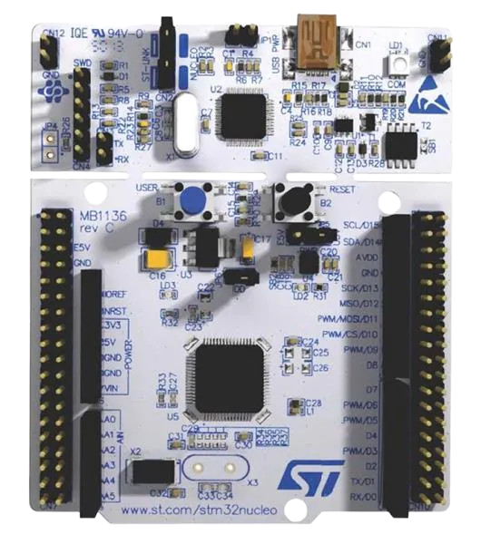

<h1 align="center">
	STM32L476xx Peripheral Library
</h1>
<p align="center">


</p>
<p align="center">

</p>

## Overview

A lightweight bare-metal peripheral drivers library for **STM32L476xx** built with the usage of CMSIS, to avoid HAL's bloat.

## Simple Examples

### GPIO Blink
```c
GPIO_Enable_Output(GPIOA,5,GPIO_OTYPE_PUSH_PULL,GPIO_PULL_UP,GPIO_SPEED_LOW);

while(1) {
	GPIO_Toggle_Pin(GPIOA, 5);
	delay_ms(1000);
}

```
Full example: [examples/gpio_blink/](examples/gpio_blink/)
### USART DMA
```c
uint8_t rx_buffer[64];
usart_handle_t husart2;

USART_Handle_Init(&husart2, USART2, USART_MODE_DMA, rx_buffer, sizeof(rx_buf));

uint8_t msg[] = "USART2\r\n";
USART_Transmit_DMA(&husart2, msg, sizeof(msg));

uint8_t data[8];
uint32_t received = USART_Read_DMA(&husart2, data, sizeof(data));
```

Full example: [examples/usart_send/](examples/usart_send/)

### SPI loopback
```c
uint8_t usart_rx_buffer[256];
usart_handle_t usart2;

uint8_t tx[] = "ABCD\r\n";
uint8_t rx[6] = {0};
spi_handle_t spi1;
spi_config_t cfg = {
	.instance = SPI1,
	.baud = SPI_BAUD_DIV_2,
	.clock_mode = SPI_CLOCK_MODE_0,
	.mode = SPI_MODE_POLLING,
	.data_size = SPI_DATASIZE_8BIT,
};

SPI_Init(&spi1, &cfg);		
USART_Handle_Init(&usart2, USART2, USART_MODE_POLLING, usart_rx_buffer , 256);

SPI_TransmitReceive8(&spi1,tx, rx, 6,100);
USART_Transmit(&usart2, rx, 6, 100);

```
Full example: [examples/spi_test/](examples/spi_test/)

## Features

| Peripheral | Notes |
|:-----------|-------|
| GPIO | input, output, af|
| USART | polling, interrupt, DMA |
| SPI | polling |
| SysTick  | 1ms tick, delay support |
| System Init | Clock config, startup code |


## Requirements
* arm-none-eabi-gcc
* arm-none-eabi-objcopy
* make
* openocd

## Targets

| Command | Description |
|:--------|-------------|
| `make` | Build `gpio_blink` |
| `make example_name` | Build *example_name* |
| `make flash` | Flash `gpio_blink.elf` with OpenOCD |
| `make flash-example_name` | Flash *example_name*  with OpenOCD |
| `make clean` | Clean the build files |

## License
This project is licensed under the MIT License.
